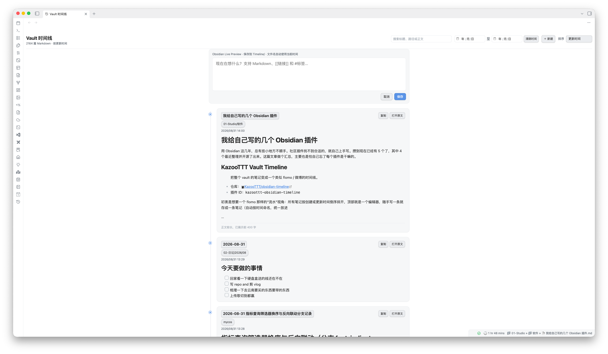

# KazooTTT Vault Timeline

将当前 Obsidian Vault 中的所有 Markdown 文件汇总到一个类似 flomo、Thino 或微博的时间线视图。

- **插件 ID**：`kazoottt-obsidian-timeline`（原名 `obsidian-timeline`，因与社区插件撞 ID 于 v0.3.1 改名）
- **仓库**：https://github.com/KazooTTT/obsidian-timeline
- **本地源码**：`/Users/kazoottt/personal/quartz/tools/obsidian-timeline/`



<!-- TODO(截图): Excalidraw 卡片预览 -->

## 功能

- 默认按文件创建时间倒序展示，也可切换为按更新时间排序
- 按开始/结束日期筛选；时间范围跟随当前创建/更新时间口径
- 搜索文件名、路径和完整正文，正文索引按需读取并缓存
- 在时间线顶部使用 Obsidian 原生 Live Preview 编辑器新建笔记，统一保存到 `Timeline/` 文件夹
- 也可点击 `＋ 新建` 创建空笔记，并在旁边打开 Obsidian 原生编辑器
- 新笔记使用可读时间命名，例如 `2026-07-31 14-32-08.md`
- 尽量继承 Obsidian 的 Markdown 编辑体验，包括 Live Preview、列表续写、`[[链接]]` 与 `#标签` 补全及常用编辑命令
- 短笔记展示全部正文；长笔记展示前 400 字并显示省略号
- Excalidraw 笔记优先展示按需生成并缓存的 SVG 画布预览，不再展开绘图数据源码
- 直接选择时间线中的文字，或点击“复制”复制完整原始内容
- 点击标题、文件路径或“打开原文”跳转到原笔记
- 全量索引 Vault，首屏加载 30 篇，向下滚动自动继续加载
- 文件创建、修改、重命名或删除后自动刷新时间线
- 支持桌面端与移动端主题、自适应窄屏布局

## 安装

### BRAT（推荐）

1. 安装 [BRAT](https://github.com/TfTHacker/obsidian42-brat)
2. 添加 Beta 插件：`KazooTTT/obsidian-timeline`
3. 在 Obsidian 的「设置 → 第三方插件」中启用 **KazooTTT Vault Timeline**

> ⚠️ 不要在社区插件市场安装名为 **Timeline** 的插件（George Butco 版），它曾与本插件撞 ID 并覆盖安装文件。

### 从源码安装到当前 Vault

```bash
npm install
npm run build:vault
```

然后在 Obsidian 的「设置 → 第三方插件」中启用 **KazooTTT Vault Timeline**。

## 使用

- 点击左侧栏的历史记录图标
- 或在命令面板执行“打开 Vault 时间线”

顶部可搜索关键词、限定开始和结束日期；“排序”下拉框可在创建时间和更新时间之间切换，选择会自动保存。

顶部始终显示内联 Live Preview 编辑器。它使用 Obsidian 自带的 Markdown 编辑内核，并提供 `Timeline/` 中的文件上下文，因此主题、Markdown 渲染、链接/标签补全、列表与常用编辑命令会尽量接近普通笔记。`⌘/Ctrl + Enter` 保存，`Esc`/“取消”清空输入框，保留搜索和排序区域不受影响。

顶部也提供 `＋ 新建`：会创建一个空条目并在旁边打开原生编辑器，时间线留在原位，因此图片粘贴、附件保存和其他编辑器能力与普通笔记一致。

> 内联编辑器依赖 Obsidian 的内置 Markdown embed。若未来版本调整该内部接口，时间线会自动降级到普通输入框，避免插件视图无法打开。

> Obsidian 提供的创建时间来自文件系统 `ctime`。复制、迁移或同步文件后，创建时间可能由操作系统重新写入；更新时间来自 `mtime`。

## 开发

```bash
npm run dev
npm run build
```
